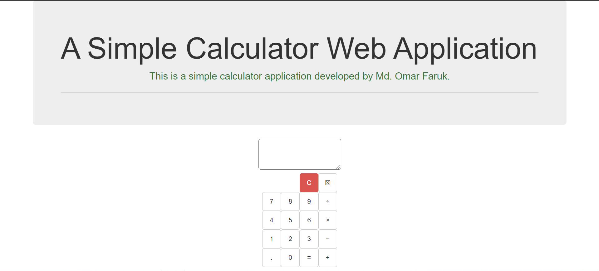
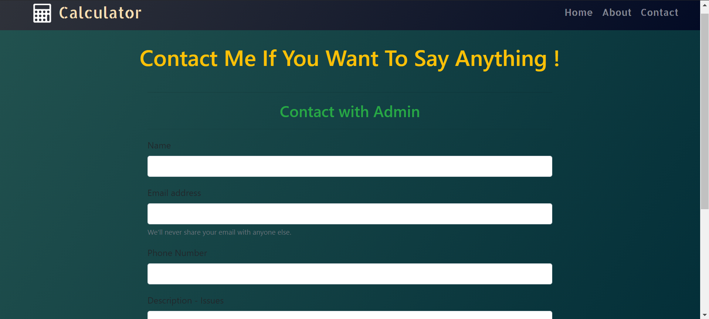

# This is A Simple Calculator WebApp Using Django and JavaScript.

  

# Features
* You can do addition
* You can do subtraction
* You can do multiplication
* You can do division
* Calculator
* User-friendly.

<!--
**[Live Demo](https://iamomar22.pythonanywhere.com/)**
-->

# Tools
## Front-end Part
* HTML
* CSS
* Bootstrap
* JavaScript
## Back-end
* Django
* SQLite 3

# Screenshots of the Project

  
  

Let's celebrate 🍕🍰🍕

If you like my project, then simply give a star 🌟✰⭐✪🔯✨

**Copyright ©** 2020-3020 Md. Omar Faruk

## Go Through This Site Then You Will Know About This Site Properly.
